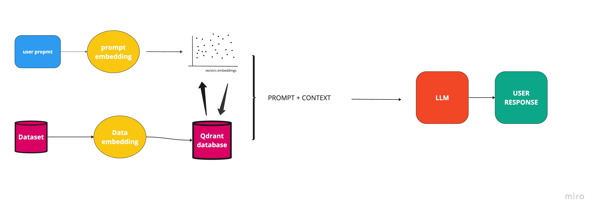

# rag-qdrant-implementation

## Enviroment variables setup 
1. Create a .env file in the root directory.
2. Pleace the following enviromental variables

```
OPENAI_API_KEY='<<YOUR_OPENAI_API_KEY>>'
QDRANT_URL='<<YOUR_QDRANT_URL>>'
QDRANT_API_KEY=<<YOUR_QDRANT_API_KEY>>
```

## Install Deps

To install the required packages inside requirements.txt, run: 
```
pip install -r requirements.txt
```

## Running the code. 

```
python main.py
```


## Visual representation

